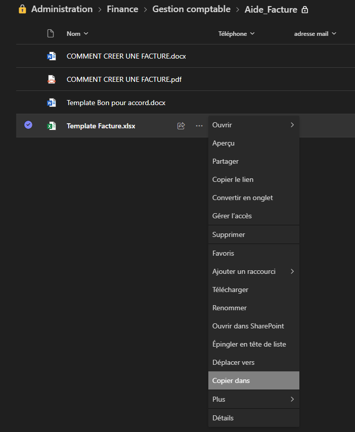

# Le devis

## Introduction
Lorsque l'association souhaite effectuer une prestation, elle se doit de suivre une démarche comprenant au moins trois documents :

1. Devis
2. Bon pour commande
3. Facture

Cela permet de protéger l'association dans des cas précis comme une analyse financière, une réclamation client, etc.


[Source](https://www.dictionnaire-academie.fr/article/A9D2245)

## Comment faire un devis
Sur le teams, dans la partie administration, aller dans Fichier -> Finances -> Gestion comptable -> aide_Facture et faire "copier dans".

Dirigez-le vers les finances de l'année actuelle.

Renommez-le "DEVIS Année mois jour - numéro".

Le numéro s'incrémente si vous faites plusieurs devis le même jour.

Ouvrez ce fichier pour compléter le devis :

* **ZONE A :**
    - Ref : la référence du devis. C’est la même que le nom de fichier (voir plus haut).
    - Date : la date à laquelle vous éditez votre devis.
    - Date d'échéance : elle est calculée automatiquement. Ne pas changer.
* **ZONE B :**
    - Complétez avec l’adresse complète du client. Si nécessaire, rajoutez le nom du contact, un téléphone et une adresse mail si vous l'avez.
* **ZONE C :**
    - Indiquez les différentes prestations réalisées.
    - Indiquez le Prix Unitaire HT.
    - Indiquez la quantité.

{% include message.html title="ATTENTION" message="Laissez la TVA à 0% car vous êtes une association et la TVA est non-applicable (article 293 B du CGI)" status="is-danger" icon="fas fa-exclamation-triangle" %}

* **ZONE D :**
    - Vérifiez le total avant de générer le devis.

## Le résultat
Vous enverrez le devis sous format PDF.

# Le bon pour commande

## À quoi sert-il ?
Le bon pour commande sert de confirmation pour les deux parties que la commande a bien été lancée et ne peut plus être annulée (sauf cas exceptionnel). C'est le client qui signe le devis avec écrit "bon pour commande", la date et le lieu. Vous pouvez aussi joindre ce document au devis pour plus de clarté.
[Bon pour commande](./Template-Bon-pour-accord.pdf)

<embed src="./Template-Bon-pour-accord.pdf" type="application/pdf" width="600" height="400">

# La facture
La facture est identique au dernier devis de la commande, et elle est envoyée après la réception du bon pour commande.



Pour générer la facture, changez les éléments signalant un devis vers facture sur le fichier Excel, puis générez votre PDF.

> Nota bene : n'hésitez pas à consulter les factures passées pour voir comment elles sont faites.
